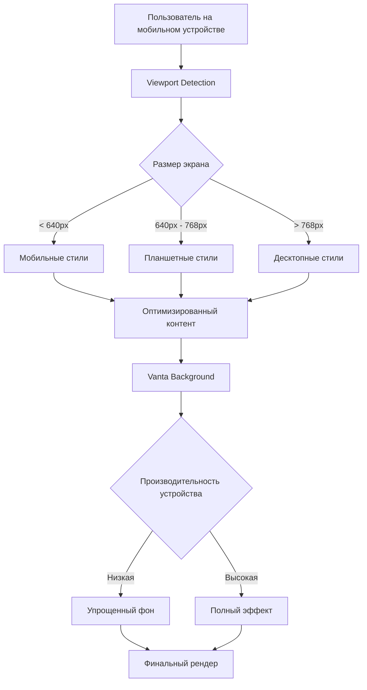

# Дизайн исправления мобильного отображения

## Обзор

Данный дизайн направлен на устранение проблем с горизонтальной прокруткой и улучшение пользовательского опыта на мобильных устройствах. Решение включает оптимизацию CSS стилей, адаптивные компоненты и улучшение производительности фоновых эффектов.

## Архитектура

### Подход к адаптивности
- **Mobile-first подход**: Стили сначала оптимизируются для мобильных устройств, затем расширяются для больших экранов
- **Прогрессивное улучшение**: Базовая функциональность работает на всех устройствах, дополнительные эффекты добавляются для более мощных устройств
- **Контейнерные запросы**: Использование современных CSS возможностей для адаптивности

### Точки останова (Breakpoints)
```css
/* Мобильные устройства */
@media (max-width: 640px) { /* sm */ }

/* Планшеты */
@media (min-width: 641px) and (max-width: 768px) { /* md */ }

/* Десктоп */
@media (min-width: 769px) { /* lg и выше */ }
```

## Компоненты и интерфейсы

### 1. Глобальные стили (index.css)
**Проблема**: Отсутствие базовых правил для предотвращения переполнения
**Решение**: Добавление глобальных правил для контроля переполнения

```css
/* Предотвращение горизонтальной прокрутки */
html, body {
  overflow-x: hidden;
  max-width: 100vw;
}

/* Адаптивные изображения */
img {
  max-width: 100%;
  height: auto;
}

/* Адаптивные контейнеры */
* {
  box-sizing: border-box;
}
```

### 2. Компонент App (App.css)
**Проблема**: Фиксированная максимальная ширина и отступы
**Решение**: Адаптивные контейнеры с условными отступами

```css
#root {
  width: 100%;
  max-width: 100vw;
  margin: 0 auto;
  padding: 1rem; /* Уменьшенные отступы для мобильных */
  text-align: center;
}

@media (min-width: 768px) {
  #root {
    max-width: 1280px;
    padding: 2rem;
  }
}
```

### 3. Главная страница (Index.tsx)
**Проблема**: Большие отступы и неоптимальные размеры для мобильных
**Решение**: Адаптивные классы Tailwind

#### Текущая структура:
```jsx
<main className="relative min-h-screen flex flex-col items-center justify-between p-6 text-white">
```

#### Оптимизированная структура:
```jsx
<main className="relative min-h-screen flex flex-col items-center justify-between p-4 sm:p-6 text-white overflow-x-hidden">
```

### 4. Заголовок и навигация
**Проблема**: Логотип и переключатель языка могут не помещаться на маленьких экранах
**Решение**: Адаптивные размеры и отступы

```jsx
<header className="w-full flex justify-between items-center mb-4 sm:mb-0">
  
  <LanguageSwitch />
</header>
```

### 5. Основной контент
**Проблема**: Слишком большие заголовки на мобильных устройствах
**Решение**: Прогрессивное масштабирование текста

```jsx
<div className="text-center max-w-full sm:max-w-3xl mx-auto px-4">
  <h1 className="text-2xl sm:text-4xl md:text-6xl font-bold mb-6 sm:mb-8 text-shadow break-words">
    {t('title')}
  </h1>
  <Button 
    onClick={handlePartnerClick}
    className="bg-transparent hover:bg-white/10 text-white text-base sm:text-lg py-4 sm:py-6 px-6 sm:px-8 rounded-full transition-all duration-300 transform hover:scale-105 w-full sm:w-auto max-w-xs sm:max-w-none"
  >
    {t('buttonText')}
  </Button>
</div>
```

### 6. Переключатель языка (LanguageSwitch.tsx)
**Проблема**: Маленькие области нажатия на мобильных устройствах
**Решение**: Увеличенные области нажатия

```jsx
<div className="language-switch flex gap-2 sm:gap-4 text-white/90">
  <span 
    className={`${language === 'ru' ? 'active' : ''} px-2 py-1 min-w-[44px] text-center`}
    onClick={() => setLanguage('ru')}
  >
    ru
  </span>
  <span 
    className={`${language === 'en' ? 'active' : ''} px-2 py-1 min-w-[44px] text-center`}
    onClick={() => setLanguage('en')}
  >
    en
  </span>
</div>
```

## Модели данных

### Конфигурация адаптивности
```typescript
interface ResponsiveConfig {
  breakpoints: {
    sm: number;
    md: number;
    lg: number;
    xl: number;
  };
  spacing: {
    mobile: string;
    tablet: string;
    desktop: string;
  };
  typography: {
    mobile: {
      h1: string;
      button: string;
    };
    desktop: {
      h1: string;
      button: string;
    };
  };
}
```

### Настройки производительности
```typescript
interface PerformanceConfig {
  enableVantaOnMobile: boolean;
  reducedMotion: boolean;
  optimizeForLowEnd: boolean;
}
```

## Обработка ошибок

### 1. Переполнение контента
- **Проблема**: Контент выходит за границы экрана
- **Решение**: CSS правила `overflow-x: hidden` и `max-width: 100vw`

### 2. Производительность на мобильных
- **Проблема**: Медленная работа Vanta эффектов
- **Решение**: Условная загрузка эффектов на основе размера экрана и производительности устройства

### 3. Неработающие touch события
- **Проблема**: Элементы слишком маленькие для нажатия
- **Решение**: Минимальный размер 44px для всех интерактивных элементов

## Стратегия тестирования

### 1. Визуальное тестирование
- Тестирование на различных размерах экранов (320px, 375px, 768px, 1024px)
- Проверка в портретной и альбомной ориентации
- Тестирование на реальных устройствах

### 2. Функциональное тестирование
- Проверка отсутствия горизонтальной прокрутки
- Тестирование всех интерактивных элементов на мобильных
- Проверка производительности фоновых эффектов

### 3. Автоматизированное тестирование
```javascript
// Пример теста для проверки отсутствия горизонтальной прокрутки
describe('Mobile Responsiveness', () => {
  it('should not have horizontal scroll on mobile', () => {
    cy.viewport(375, 667);
    cy.visit('/');
    cy.get('body').should('have.css', 'overflow-x', 'hidden');
    cy.window().its('scrollX').should('equal', 0);
  });
});
```

### 4. Производительность
- Измерение времени загрузки на мобильных устройствах
- Мониторинг использования памяти при работе Vanta эффектов
- Проверка плавности анимаций (60 FPS)

## Диаграмма архитектуры

