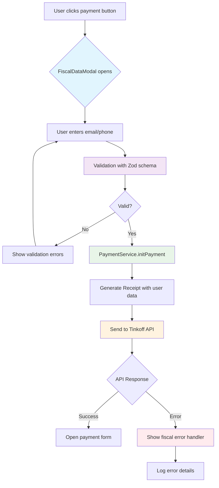

# 🏗️ Архитектура решения проблемы с фискальными чеками

## 📊 Диаграмма компонентов



## 🎯 Ключевые компоненты решения

### 1. FiscalDataModal Component
**Назначение:** Модальное окно для сбора email/телефон пользователя
**Технологии:** React Hook Form + Zod + Radix UI Dialog

```typescript
interface FiscalDataModalProps {
  isOpen: boolean;
  onClose: () => void;
  onSubmit: (data: FiscalData) => void;
  isLoading?: boolean;
}

interface FiscalData {
  email?: string;
  phone?: string;
  preferredContact: 'email' | 'phone';
}
```

### 2. Enhanced PaymentService
**Назначение:** Обработка платежей с поддержкой фискальных данных
**Ключевые изменения:**
- Динамическое формирование Receipt
- Валидация фискальных данных
- Улучшенная обработка ошибок

### 3. Updated Payment Components
**Компоненты:** TinkoffPaymentCorrect, TinkoffPaymentFinal
**Изменения:**
- Интеграция с FiscalDataModal
- Передача пользовательских данных в PaymentService
- Обработка ошибок фискализации

### 4. FiscalErrorHandler
**Назначение:** Централизованная обработка ошибок фискализации
**Функции:**
- Логирование ошибок Tinkoff API
- Пользовательские сообщения об ошибках
- Повторные попытки при сбоях

### 5. TestPayment Page
**Назначение:** Страница для тестирования платежей
**Функции:**
- Тестирование различных сценариев фискализации
- Отладка интеграции с Tinkoff API
- Валидация данных пользователей

## 🔧 Технические требования

### Схема валидации (Zod)
```typescript
const fiscalDataSchema = z.object({
  email: z.string().email('Некорректный email').optional(),
  phone: z.string().regex(/^\+7\d{10}$/, 'Телефон должен быть в формате +7XXXXXXXXXX').optional(),
  preferredContact: z.enum(['email', 'phone'])
}).refine(
  (data) => data.email || data.phone,
  {
    message: "Укажите email или телефон для получения чека",
    path: ["preferredContact"]
  }
);
```

### API интерфейсы
```typescript
interface EnhancedPaymentData {
  amount: number;
  orderId: string;
  description: string;
  itemName?: string;
  customerKey?: string;
  fiscalData: FiscalData; // ✅ НОВОЕ поле
}

interface TinkoffReceiptItem {
  Name: string;
  Price: number;
  Quantity: number;
  Amount: number;
  Tax: 'none' | 'vat0' | 'vat10' | 'vat18' | 'vat20';
  PaymentMethod?: 'full_prepayment' | 'prepayment' | 'advance' | 'full_payment' | 'partial_payment';
}

interface TinkoffReceipt {
  Email?: string; // ✅ Динамический
  Phone?: string; // ✅ Динамический
  Taxation: 'usn_income' | 'osn' | 'usn_income_out' | 'usn_expenses';
  Items: TinkoffReceiptItem[];
}
```

## 🎨 UX/UI Design

### FiscalDataModal Layout
```
┌─────────────────────────────────────┐
│  🧾 Данные для фискального чека      │
├─────────────────────────────────────┤
│                                     │
│  Для получения чека укажите:        │
│                                     │
│  ○ Email                            │
│  📧 [___________________]           │
│                                     │
│  ○ Телефон                          │
│  📱 [+7________________]            │
│                                     │
│  ℹ️ Один из контактов обязателен    │
│                                     │
│  [Отмена]  [Продолжить к оплате]   │
└─────────────────────────────────────┘
```

### Error Handling UI
```
┌─────────────────────────────────────┐
│  ⚠️ Ошибка фискализации             │
├─────────────────────────────────────┤
│                                     │
│  Не удалось создать фискальный чек  │
│                                     │
│  • Проверьте корректность email     │
│  • Убедитесь в формате телефона     │
│                                     │
│  [Попробовать снова]  [Без чека]   │
└─────────────────────────────────────┘
```

## 📋 План реализации

### Фаза 1: Базовые компоненты (2-3 дня)
- [x] Анализ проблемы и требований
- [ ] Создание FiscalDataModal компонента
- [ ] Реализация Zod валидации
- [ ] Обновление типов данных

### Фаза 2: Интеграция платежей (2-3 дня)
- [ ] Модификация PaymentService
- [ ] Обновление TinkoffPaymentCorrect
- [ ] Обновление TinkoffPaymentFinal
- [ ] Создание FiscalErrorHandler

### Фаза 3: Тестирование (2-3 дня)
- [ ] Создание TestPayment страницы
- [ ] Интеграционные тесты с Tinkoff API
- [ ] Тестирование edge cases
- [ ] Оптимизация UX

### Фаза 4: Документация (1 день)
- [ ] Создание пользовательской документации
- [ ] Обновление README
- [ ] Создание troubleshooting guide

## 🔍 Критерии успеха

### Функциональные требования
- ✅ Пользователь может ввести email или телефон
- ✅ Валидация данных работает корректно
- ✅ Receipt формируется с реальными данными пользователя
- ✅ Tinkoff API принимает запросы без ошибок
- ✅ Пользователь получает чек на указанные контакты

### Технические требования
- ✅ Нет ошибки "Error 329: Неверные параметры"
- ✅ Корректная обработка всех ошибок фискализации
- ✅ Логирование для отладки и мониторинга
- ✅ Отзывчивый UI на всех устройствах
- ✅ Соответствие ФФД 1.05/1.2

### UX требования
- ✅ Интуитивно понятный интерфейс
- ✅ Быстрое заполнение формы (< 30 секунд)
- ✅ Понятные сообщения об ошибках
- ✅ Возможность исправить данные

## ⚠️ Риски и митигация

### Технические риски
**Риск:** Изменения могут нарушить существующую функциональность  
**Митигация:** Пошаговое тестирование каждого компонента

**Риск:** Новые требования Tinkoff API  
**Митигация:** Регулярная проверка документации API

### UX риски
**Риск:** Пользователи могут не захотеть вводить данные  
**Митигация:** Четкое объяснение необходимости для получения чека

**Риск:** Проблемы на мобильных устройствах  
**Митигация:** Адаптивная верстка и тестирование на устройствах

## 🚀 Готовность к переходу в режим Code

Архитектура полностью спроектирована. Готовы к реализации:

1. **Компоненты определены** - все интерфейсы и пропы специфицированы
2. **Технологии выбраны** - React Hook Form + Zod + Radix UI
3. **API интеграция спланирована** - измененияв PaymentService детализированы  
4. **UX проработан** - макеты модального окна и обработки ошибок готовы
5. **План тестирования создан** - TestPayment страница в разработке

**Рекомендация:** Переход в Code режим для начала реализации.